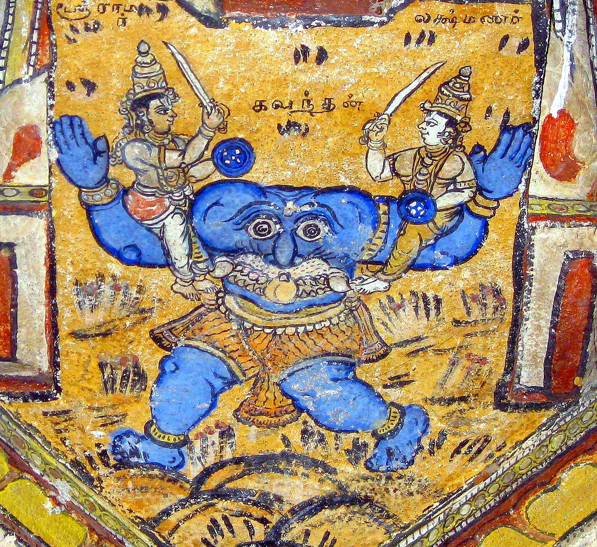

+++
title = "263 ರಾಮೋಪಾಖ್ಯಾನೇ ಕಬಂಧಹನನಃ"
+++

ಪ್ರವೇಶ

।।   ಓಂ ಓಂ ನಮೋ ನಾರಾಯಣಾಯ।।   ಶ್ರೀ ವೇದವ್ಯಾಸಾಯ ನಮಃ ।।

ಶ್ರೀ ಕೃಷ್ಣದ್ವೈಪಾಯನ ವೇದವ್ಯಾಸ ವಿರಚಿತ  

**ಶ್ರೀ ಮಹಾಭಾರತ**

**ಆರಣ್ಯಕ ಪರ್ವ**

**ದ್ರೌಪದೀಹರಣ ಪರ್ವ**

**ಅಧ್ಯಾಯ 263**

ಸಾರ

ಸೀತೆಯನ್ನು ಬಿಡಿಸಲು ಬಂದು ಎದುರಾದ ದಶರಥನ ಸಖ ಜಟಾಯುವಿನ ರೆಕ್ಕೆಗಳನ್ನು ಕತ್ತರಿಸಿ, ಸೀತೆಯನ್ನು ತೋಳಿನಲ್ಲಿ ಹಿಡಿದು ರಾವಣನು ಮೇಲಕ್ಕೇರಿದುದು; ದಾರಿಯಲ್ಲಿ ನದೀ ಸರೋವರಗಳು ಕಂಡಲ್ಲಿ ಸೀತೆಯು ತನ್ನ ಆಭರಣವನ್ನು ಮತ್ತು ಗಿರಿಪ್ರಸ್ಥದಲ್ಲಿ ಐವರು ವಾನರರನ್ನು ಕಂಡು ಅವರ ಮಧ್ಯೆ ವಸ್ತ್ರವನ್ನು ಎಸೆದುದು (1-10). ಮಾರೀಚನನ್ನು ಕೊಂದು ಹಿಂದಿರುಗುತ್ತಿರುವಾಗ ಲಕ್ಷ್ಮಣನನ್ನು ನೋಡಿದ ರಾಮನು ಅವನು ಏಕೆ ಸೀತೆಯೊಬ್ಬಳನ್ನೇ ಬಿಟ್ಟು ಬಂದನೆಂದು ಬೈಯುತ್ತಾ ಬರುವಾಗ ಮಾರ್ಗದಲ್ಲಿ ಗಾಯಗೊಂಡು ಬಿದ್ದು ದಶರಥನ ನಾಮೋಶ್ಚರಣೆ ಮಾಡುತ್ತಿದ್ದ ಜಟಾಯುವನ್ನು ನೋಡಿ ಸೀತೆಯನ್ನು ಅಪಹರಿಸಿಕೊಂಡು ರಾವಣನು ಹೋದ ದಿಕ್ಕನ್ನು ತೋರಿಸಿ ಮೃತನಾದ ಅವನಿಗೆ ಅಂತ್ಯಕ್ರಿಯೆ ನೆರವೇರಿಸಿದುದು (11-21). ಸೀತೆಯನ್ನರಸಿ ದಕ್ಷಿಣದ ಕಡೆ ಹೋಗುವಾಗ ಕಬಂಧನೆಂಬ ರಾಕ್ಷಸನು ಲಕ್ಷ್ಮಣನನ್ನು ಹಿಡಿದುದು (22-31). ರಾಮನಿಂದ ವಧಿಸಲ್ಪಟ್ಟು ಶಾಪವಿಮೋಚನಗೊಂಡ ಕಬಂಧನು ಋಷ್ಯಮೂಕದಲ್ಲಿರುವ ಸುಗ್ರೀವನು ಸೀತೆಯನ್ನು ಹುಡುಕುವಲ್ಲಿ ಸಹಾಯ ಮಾಡುತ್ತೇನೆಂದು ಹೇಳಿ ಗಂಧರ್ವಲೋಕವನ್ನು ಸೇರುವುದು (32-43).

> 03263001 ಮಾರ್ಕಂಡೇಯ ಉವಾಚ।  
03263001a ಸಖಾ ದಶರಥಸ್ಯಾಸೀಜ್ಜಟಾಯುರರುಣಾತ್ಮಜಃ।   
03263001c ಗೃಧ್ರರಾಜೋ ಮಹಾವೀರ್ಯಃ ಸಂಪಾತಿರ್ಯಸ್ಯ ಸೋದರಃ।।

ಮಾರ್ಕಂಡೇಯನು ಹೇಳಿದನು: “ಆ ಅರುಣನ ಮಗ, ಸಂಪಾತಿಯ ಸೋದರ ಗೃಧ್ರರಾಜ ಮಹಾವೀರ್ಯ ಜಟಾಯುವು ದಶರಥನ  ಸಖನಾಗಿದ್ದನು.

> 03263002a ಸ ದದರ್ಶ ತದಾ ಸೀತಾಂ ರಾವಣಾಂಕಗತಾಂ ಸ್ನುಷಾಂ।  
03263002c ಕ್ರೋಧಾದಭ್ಯದ್ರವತ್ಪಕ್ಷೀ ರಾವಣಂ ರಾಕ್ಷಸೇಶ್ವರಂ।।

ರಾವಣನ ಹೆಗಲಿನ ಹಿಡಿತದಲ್ಲಿದ್ದ ಅವನ ಸೊಸೆ ಸೀತೆಯನ್ನು ನೋಡಿ ಆ ಪಕ್ಷಿಯು ರಾಕ್ಷಸೇಶ್ವರ ರಾವಣನ ಮೇಲೆ ಸಿಟ್ಟಾದನು.

> 03263003a ಅಥೈನಮಬ್ರವೀದ್ಗೃಧ್ರೋ ಮುಂಚ ಮುಂಚೇತಿ ಮೈಥಿಲೀಂ।  
03263003c ಧ್ರಿಯಮಾಣೇ ಮಯಿ ಕಥಂ ಹರಿಷ್ಯಸಿ ನಿಶಾಚರ।  
03263003e ನ ಹಿ ಮೇ ಮೋಕ್ಷ್ಯಸೇ ಜೀವನ್ಯದಿ ನೋತ್ಸೃಜಸೇ ವಧೂಂ।।

ಆಗ ಆ ಹದ್ದು ಹೇಳಿತು: “ಮೈಥಿಲಿಯನ್ನು ಬಿಟ್ಟುಬಿಡು! ನಾನು ಇನ್ನೂ ಜೀವಿತನಾಗಿರುವಾಗ ನೀನು ಅವಳನ್ನು ಹೇಗೆ ಅಪಹರಿಸಿಕೊಂಡು ಹೋಗುತ್ತಿದ್ದೀಯೆ ನಿಶಾಚರ! ಈ ವಧುವನ್ನು ಬಿಟ್ಟುಬಿಡದಿದ್ದರೆ ಜೀವಂತನಾಗಿರುವ ನನ್ನಿಂದ ನೀನು ಬಿಡುಗಡೆ ಹೊಂದುವುದಿಲ್ಲ!”

> 03263004a ಉಕ್ತ್ವೈವಂ ರಾಕ್ಷಸೇಂದ್ರಂ ತಂ ಚಕರ್ತ ನಖರೈರ್ಭೃಶಂ।  
03263004c ಪಕ್ಷತುಂಡಪ್ರಹಾರೈಶ್ಚ ಬಹುಶೋ ಜರ್ಜರೀಕೃತಃ।  
03263004e ಚಕ್ಷಾರ ರುಧಿರಂ ಭೂರಿ ಗಿರಿಃ ಪ್ರಸ್ರವಣೈರಿವ।।

ಆ ರಾಕ್ಷಸೇಂದ್ರನಿಗೆ ಹೀಗೆ ಹೇಳಿ ಅವನು ಅವನನ್ನು ತನ್ನ ಉಗುರುಗಳಿಂದ ಹರಿದನು ಮತ್ತು ತನ್ನ ಕೊಕ್ಕು ಮತ್ತು ರೆಕ್ಕೆಗಳಿಂದ ಹೊಡೆದು ಚೆನ್ನಾಗಿ ಗಾಯಗೊಳಿಸಿ, ಗಿರಿಯ ಮೇಲೆ ಖನಿಜಗಳ ನದಿಯು ಹರಿಯುವಂತೆ ಅವನ ದೇಹದಿಂದ ರಕ್ತವು ಹರಿಯುವಂತೆ ಮಾಡಿದನು.

> 03263005a ಸ ವಧ್ಯಮಾನೋ ಗೃಧ್ರೇಣ ರಾಮಪ್ರಿಯಹಿತೈಷಿಣಾ।  
03263005c ಖಡ್ಗಮಾದಾಯ ಚಿಚ್ಚೇದ ಭುಜೌ ತಸ್ಯ ಪತತ್ರಿಣಃ।।

ರಾಮ ಪ್ರಿಯಹಿತೈಷಿ ಹದ್ದಿನಿಂದ ಈ ರೀತಿ ಹೊಡೆತಕ್ಕೆ ಸಿಲುಕಿದ ಅವನು ಖಡ್ಗದಿಂದ ಅವನ ರೆಕ್ಕೆಗಳನ್ನು ಕತ್ತರಿಸಿದನು.

> 03263006a ನಿಹತ್ಯ ಗೃಧ್ರರಾಜಂ ಸ ಚಿನ್ನಾಭ್ರಶಿಖರೋಪಮಂ।  
03263006c ಊರ್ಧ್ವಮಾಚಕ್ರಮೇ ಸೀತಾಂ ಗೃಹೀತ್ವಾಂಕೇನ ರಾಕ್ಷಸಃ।।

ಚೂರುಚೂರಾದ ಮೋಡಗಳೊಂದಿಗೆ ಗಿರಿಯನ್ನು ಹೇಗೋ ಹಾಗೆ ಆ ಗೃಧ್ರರಾಜನನ್ನು ಹೊಡೆದುರಿಳಿಸಿ ರಾಕ್ಷಸನು ಸೀತೆಯನ್ನು ತೋಳಿನಲ್ಲಿ ಹಿಡಿದು ಮೇಲಕ್ಕೇರಿದನು.

> 03263007a ಯತ್ರ ಯತ್ರ ತು ವೈದೇಹೀ ಪಶ್ಯತ್ಯಾಶ್ರಮಮಂಡಲಂ।  
03263007c ಸರೋ ವಾ ಸರಿತಂ ವಾಪಿ ತತ್ರ ಮುಂಚತಿ ಭೂಷಣಂ।।

ಎಲ್ಲೆಲ್ಲಿ ಆಶ್ರಮ ಮಂಡಲಗಳು, ಸರೋವರಗಳು, ಅಥವಾ ನದಿಗಳನ್ನು ನೋಡಿದಳೋ ಅಲ್ಲಲ್ಲಿ ವೈದೇಹಿಯು ತನ್ನ ಆಭರಣಗಳನ್ನು ಬಿಚ್ಚಿ ಎಸೆದಳು.

> 03263008a ಸಾ ದದರ್ಶ ಗಿರಿಪ್ರಸ್ಥೇ ಪಂಚ ವಾನರಪುಂಗವಾನ್।  
03263008c ತತ್ರ ವಾಸೋ ಮಹದ್ದಿವ್ಯಮುತ್ಸಸರ್ಜ ಮನಸ್ವಿನೀ।।

ಆ ಮನಸ್ವಿನಿಯು ಗಿರಿಪ್ರಸ್ಥದಲ್ಲಿ ಐದು ವಾನರಪುಂಗವರನ್ನು ನೋಡಿ ಅಲ್ಲಿ ಮಹಾದಿವ್ಯ ವಸ್ತ್ರವನ್ನು ಎಸೆದಳು.

> 03263009a ತತ್ತೇಷಾಂ ವಾನರೇಂದ್ರಾಣಾಂ ಪಪಾತ ಪವನೋದ್ಧುತಂ।  
03263009c ಮಧ್ಯೇ ಸುಪೀತಂ ಪಂಚಾನಾಂ ವಿದ್ಯುನ್ಮೇಘಾಂತರೇ ಯಥಾ।।

ಆಗ ಆ ವಾನರೇಂದ್ರರು ಮೇಘಗಳ ಮಧ್ಯೆ ಕಾಣುವ ಮಿಂಚಿನಂತೆ ಗಾಳಿಯಲ್ಲಿ ಬಂದು ಮಧ್ಯೆ ಬಿದ್ದ ಆ ಅರಿಶಿಣ ಬಣ್ಣದ ಬಟ್ಟೆಯನ್ನು ನೋಡಿದರು.

> 03263010a ಏವಂ ಹೃತಾಯಾಂ ವೈದೇಹ್ಯಾಂ ರಾಮೋ ಹತ್ವಾ ಮಹಾಮೃಗಂ।  
03263010c ನಿವೃತ್ತೋ ದದೃಶೇ ಧೀಮಾನ್ಭ್ರಾತರಂ ಲಕ್ಷ್ಮಣಂ ತದಾ।।

ಹೀಗೆ ವೈದೇಹಿಯು ಅಪಹೃತಳಾಗಲು ರಾಮನು ಮಹಾಮೃಗವನ್ನು ಕೊಂದು ಹಿಂದಿರುಗುತ್ತಿದ್ದಾಗ ಧೀಮಾನ್ ತಮ್ಮ ಲಕ್ಷ್ಮಣನನ್ನು ನೋಡಿದನು.

> 03263011a ಕಥಮುತ್ಸೃಜ್ಯ ವೈದೇಹೀಂ ವನೇ ರಾಕ್ಷಸಸೇವಿತೇ।  
03263011c ಇತ್ಯೇವಂ ಭ್ರಾತರಂ ದೃಷ್ಟ್ವಾ ಪ್ರಾಪ್ತೋಽಸೀತಿ ವ್ಯಗರ್ಹಯತ್।।

“ರಾಕ್ಷಸರಿರುವ ಈ ವನದಲ್ಲಿ ವೈದೇಹಿಯನ್ನು ಹೇಗೆ ಬಿಟ್ಟು ಇಲ್ಲಿಗೆ ಬಂದೆ?” ಎಂದು ತಮ್ಮನನ್ನು ನೋಡಿ ಬೈದನು.

> 03263012a ಮೃಗರೂಪಧರೇಣಾಥ ರಕ್ಷಸಾ ಸೋಽಪಕರ್ಷಣಂ।  
03263012c ಭ್ರಾತುರಾಗಮನಂ ಚೈವ ಚಿಂತಯನ್ಪರ್ಯತಪ್ಯತ।।

ತನ್ನನ್ನು ಎಳೆದುಕೊಂಡು ಹೋದ ಮೃಗರೂಪವನ್ನು ಧರಿಸಿದ್ದ ರಾಕ್ಷಸ ಮತ್ತು ತಮ್ಮನು ಬರುತ್ತಿರುವುದರ ಕುರಿತು ಚಿಂತಿಸಿ ಪರಿತಪಿಸಿದನು.

> 03263013a ಗರ್ಹಯನ್ನೇವ ರಾಮಸ್ತು ತ್ವರಿತಸ್ತಂ ಸಮಾಸದತ್।  
03263013c ಅಪಿ ಜೀವತಿ ವೈದೇಹೀ ನೇತಿ ಪಶ್ಯಾಮಿ ಲಕ್ಷ್ಮಣ।।

ಅವನನ್ನು ಈ ರೀತಿ ಬಯ್ಯುತ್ತ ರಾಮನು ಬೇಗನೇ ಅವನ ಬಳಿಸಾರಿ “ಲಕ್ಷ್ಮಣ! ಸೀತೆಯು ಜೀವಿತಳಾಗಿದ್ದಾಳೆಯೇ? ಅವಳನ್ನು ಕಾಣುತ್ತಿಲ್ಲ!” ಎಂದು ಕೇಳಿದನು.

> 03263014a ತಸ್ಯ ತತ್ಸರ್ವಮಾಚಖ್ಯೌ ಸೀತಾಯಾ ಲಕ್ಷ್ಮಣೋ ವಚಃ।  
03263014c ಯದುಕ್ತವತ್ಯಸದೃಶಂ ವೈದೇಹೀ ಪಶ್ಚಿಮಂ ವಚಃ।।

ಲಕ್ಷ್ಮಣನು ಅವನಿಗೆ ಸೀತೆಯು ಹೇಳಿದ ಎಲ್ಲ ಮಾತುಗಳನ್ನೂ ತಿಳಿಸಿದನು. ಕೊನೆಯಲ್ಲಿ ವೈದೇಹಿಯು ಹೇಳಿದ ಎಲ್ಲ ಅಪಚಾರದ ಮಾತುಗಳನ್ನೂ ಪುನರಾವರ್ತಿಸಿದನು.

> 03263015a ದಹ್ಯಮಾನೇನ ತು ಹೃದಾ ರಾಮೋಽಭ್ಯಪತದಾಶ್ರಮಂ।  
03263015c ಸ ದದರ್ಶ ತದಾ ಗೃಧ್ರಂ ನಿಹತಂ ಪರ್ವತೋಪಮಂ।।

ಸುಡುತ್ತಿರುವ ಹೃದಯದೊಂದಿಗೆ ರಾಮನು ಆಶ್ರಮದ ಕಡೆ ಓಡಿದನು. ಆಗ ಅವನು ಹೊಡೆತಕ್ಕೆ ಸಿಲುಕಿ ಉರುಳಿ ಬಿದ್ದಿದ್ದ ಪರ್ವತದಂತಿದ್ದ ಹದ್ದನ್ನು ನೋಡಿದನು.

> 03263016a ರಾಕ್ಷಸಂ ಶಂಕಮಾನಸ್ತು ವಿಕೃಷ್ಯ ಬಲವದ್ಧನುಃ।  
03263016c ಅಭ್ಯಧಾವತ ಕಾಕುತ್ಸ್ಥಸ್ತತಸ್ತಂ ಸಹಲಕ್ಷ್ಮಣಃ।।

ರಾಕ್ಷಸನೆಂದು ಶಂಕಿಸಿ ಬಲವಾದ ಧನುವನ್ನು ಎಳೆದು ಆ ಕಾಕುತ್ಸ್ಥನು ಲಕ್ಷ್ಮಣನೊಡನೆ ಅವನ ಬಳಿ ಓಡಿಬಂದನು.

> 03263017a ಸ ತಾವುವಾಚ ತೇಜಸ್ವೀ ಸಹಿತೌ ರಾಮಲಕ್ಷ್ಮಣೌ।  
03263017c ಗೃಧ್ರರಾಜೋಽಸ್ಮಿ ಭದ್ರಂ ವಾಂ ಸಖಾ ದಶರಥಸ್ಯ ಹ।।

ಆ ತೇಜಸ್ವಿಯು ರಾಮಲಕ್ಷ್ಮಣರಿಗೆ ಒಟ್ಟಿಗೇ ಹೇಳಿದನು: “ನಾನು ಹದ್ದುಗಳ ರಾಜ. ಮಂಗಳವಾಗಲಿ. ದಶರಥನ ಸಖನೂ ಹೌದು.”

> 03263018a ತಸ್ಯ ತದ್ವಚನಂ ಶ್ರುತ್ವಾ ಸಂಗೃಹ್ಯ ಧನುಷೀ ಶುಭೇ।  
03263018c ಕೋಽಯಂ ಪಿತರಮಸ್ಮಾಕಂ ನಾಮ್ನಾಹೇತ್ಯೂಚತುಶ್ಚ ತೌ।।

ಅವನ ಆ ಮಾತುಗಳನ್ನು ಕೇಳಿ ಅವರು ಶುಭ ದನುಸ್ಸುಗಳನ್ನು ಸಡಿಲಗೊಳಿಸಿ ಕೇಳಿದರು. “ನಮ್ಮ ತಂದೆಯ ಹೆಸರನ್ನು ಹೇಳುವ ನೀನು ಯಾರು?”

> 03263019a ತತೋ ದದೃಶತುಸ್ತೌ ತಂ ಚಿನ್ನಪಕ್ಷದ್ವಯಂ ತಥಾ।  
03263019c ತಯೋಃ ಶಶಂಸ ಗೃಧ್ರಸ್ತು ಸೀತಾರ್ಥೇ ರಾವಣಾದ್ವಧಂ।।

ಆಗ ಆ ಹದ್ದು ಅವರಿಗೆ ಕತ್ತರಿಸಲ್ಪಟ್ಟ ತನ್ನ ರೆಕ್ಕೆಗಳೆರಡನ್ನೂ ತೋರಿಸಿ ಸೀತೆಗಾಗಿ ರಾವಣನ ಹೊಡೆತದ ಕುರಿತು ವರದಿಮಾಡಿದನು.

> 03263020a ಅಪೃಚ್ಚದ್ರಾಘವೋ ಗೃಧ್ರಂ ರಾವಣಃ ಕಾಂ ದಿಶಂ ಗತಃ।   
03263020c ತಸ್ಯ ಗೃಧ್ರಃ ಶಿರಃಕಂಪೈರಾಚಚಕ್ಷೇ ಮಮಾರ ಚ।।

ರಾವಣನು ಯಾವ ದಿಕ್ಕಿನಲ್ಲಿ ಹೋದ ಎಂದು ರಾಘವನು ಹದ್ದಿಗೆ ಕೇಳಿದನು. ಆ ಹದ್ದು ತನ್ನ ತಲೆಯನ್ನು ತಿರುಗಿಸಿ ತೋರಿಸಿಕೊಟ್ಟು ಮೃತನಾದನು.

> 03263021a ದಕ್ಷಿಣಾಮಿತಿ ಕಾಕುತ್ಸ್ಥೋ ವಿದಿತ್ವಾಸ್ಯ ತದಿಂಗಿತಂ।  
03263021c ಸಂಸ್ಕಾರಂ ಲಂಭಯಾಮಾಸ ಸಖಾಯಂ ಪೂಜಯನ್ಪಿತುಃ।।

ಅವನ ಇಂಗಿತವು ದಕ್ಷಿಣ ಎಂದು ತಿಳಿದ ಕಾಕುತ್ಸ್ಥನು ತನ್ನ ತಂದೆಯ ಸಖನಿಗೆ ಪೂಜಿಸಿ ಸಂಸ್ಕಾರವನ್ನು ನೆರವೇರಿಸಿದನು.

> 03263022a ತತೋ ದೃಷ್ಟ್ವಾಶ್ರಮಪದಂ ವ್ಯಪವಿದ್ಧಬೃಸೀಘಟಂ।  
03263022c ವಿಧ್ವಸ್ತಕಲಶಂ ಶೂನ್ಯಂ ಗೋಮಾಯುಬಲಸೇವಿತಂ।।

ಅವನು ಆ ಆಶ್ರಮಪದವು ಶೂನ್ಯವಾಗಿರುವುದನ್ನು ಕಂಡನು. ತಲೆದಿಂಬು ಮತ್ತು ಪಾತ್ರೆಗಳು ಅಸ್ತವ್ಯಸ್ತವಾಗಿದ್ದವು. ಕಲಶಗಳು ಉರುಳಿಬಿದ್ದಿದ್ದವು ಮತ್ತು ಆ ಸ್ಥಳವು ನರಿಗಳ ಗುಂಪುಗಳಿಂದ ಕೂಡಿತ್ತು.

> 03263023a ದುಃಖಶೋಕಸಮಾವಿಷ್ಟೌ ವೈದೇಹೀಹರಣಾರ್ದಿತೌ।  
03263023c ಜಗ್ಮತುರ್ದಂಡಕಾರಣ್ಯಂ ದಕ್ಷಿಣೇನ ಪರಂತಪೌ।।

ವೈದೇಹೀ ಹರಣದಿಂದ ಆರ್ದಿತರಾಗಿ ದುಃಖಶೋಕಸಮಾವಿಷ್ಟರಾದ ಅವರಿಬ್ಬರು ಪರಂತಪರೂ ದಕ್ಷಿಣದಲ್ಲಿದ್ದ ದಂಡಕಾರಣ್ಯಕ್ಕೆ ಹೋದರು.

> 03263024a ವನೇ ಮಹತಿ ತಸ್ಮಿಂಸ್ತು ರಾಮಃ ಸೌಮಿತ್ರಿಣಾ ಸಹ।  
03263024c ದದರ್ಶ ಮೃಗಯೂಥಾನಿ ದ್ರವಮಾಣಾನಿ ಸರ್ವಶಃ।  
03263024e ಶಬ್ದಂ ಚ ಘೋರಂ ಸತ್ತ್ವಾನಾಂ ದಾವಾಗ್ನೇರಿವ ವರ್ಧತಃ।।

ಆ ಮಹಾ ವನದಲ್ಲಿ ಸೌಮಿತ್ರಿಯ ಸಹಿತ ರಾಮನು ಜಿಂಕೆಯ ಹಿಂಡುಗಳು ಎಲ್ಲಕಡೆಯಲ್ಲಿಯೂ ಓಡಿಹೋಗುತ್ತಿರುವುದನ್ನು ನೋಡಿದನು ಮತ್ತು ದಾವಾಗ್ನಿಯಂತಿರುವ ಎಲ್ಲ ಜೀವಿಗಳ ಘೋರ ಕೂಗನ್ನೂ ಕೇಳಿದನು.

> 03263025a ಅಪಶ್ಯೇತಾಂ ಮುಹೂರ್ತಾಚ್ಚ ಕಬಂಧಂ ಘೋರದರ್ಶನಂ।   
03263025c ಮೇಘಪರ್ವತಸಂಕಾಶಂ ಶಾಲಸ್ಕಂಧಂ ಮಹಾಭುಜಂ।  
03263025e ಉರೋಗತವಿಶಾಲಾಕ್ಷಂ ಮಹೋದರಮಹಾಮುಖಂ।।

ಸ್ವಲ್ಪ ಹೊತ್ತಿನಲ್ಲಿಯೇ ಅವರು ಮೋಡದ ಪರ್ವತದಂತೆ ತೋರುತ್ತಿದ್ದ, ಶಾಲವೃಕ್ಷದಂತಿದ್ದ ತೋಳುಗಳುಳ್ಳ, ಮಹಾಭುಜ, ಎದೆಯಲ್ಲಿ ಒಂದೇ ಒಂದು ವಿಶಾಲ ಕಣ್ಣನ್ನು ಹೊಂದಿದ್ದ, ದೊಡ್ಡ ಹೊಟ್ಟೆಯ, ಮಹಾಮುಖಿ, ಘೋರವಾಗಿ ಕಾಣುತ್ತಿದ್ದ ಕಂಬಂಧನನ್ನು ಕಂಡರು.

> 03263026a ಯದೃಚ್ಚಯಾಥ ತದ್ರಕ್ಷಃ ಕರೇ ಜಗ್ರಾಹ ಲಕ್ಷ್ಮಣಂ।   
03263026c ವಿಷಾದಮಗಮತ್ಸದ್ಯಃ ಸೌಮಿತ್ರಿರಥ ಭಾರತ।।

ಭಾರತ! ಆ ರಾಕ್ಷಸನು ಲಕ್ಷ್ಮಣನನ್ನು ಕೈಗಳಿಂದ ಹಿಡಿದನು ಮತ್ತು ತಕ್ಷಣವೇ ಸೌಮಿತ್ರಿಯು ಶೋಕಕ್ಕೊಳಗಾದನು.

> 03263027a ಸ ರಾಮಮಭಿಸಂಪ್ರೇಕ್ಷ್ಯ ಕೃಷ್ಯತೇ ಯೇನ ತನ್ಮುಖಂ।  
03263027c ವಿಷಣ್ಣಶ್ಚಾಬ್ರವೀದ್ರಾಮಂ ಪಶ್ಯಾವಸ್ಥಾಮಿಮಾಂ ಮಮ।।

ಅವನು ತನ್ನನ್ನು ಬಾಯಿಯೆಡೆಗೆ ಒಯ್ಯುತ್ತಿರುವಾಗ ರಾಮನ ಕಡೆ ನೋಡಿ ವಿಷಣ್ಣನಾಗಿ ಹೇಳಿದನು: “ರಾಮ! ನನ್ನ ಈ ಅವಸ್ಥೆಯನ್ನು ನೋಡು!

> 03263028a ಹರಣಂ ಚೈವ ವೈದೇಹ್ಯಾ ಮಮ ಚಾಯಮುಪಪ್ಲವಃ।  
03263028c ರಾಜ್ಯಭ್ರಂಶಶ್ಚ ಭವತಸ್ತಾತಸ್ಯ ಮರಣಂ ತಥಾ।।

ವೈದೇಹಿಯ ಅಪಹರಣ, ನನ್ನ ಈ ಉಪಪ್ಲವ, ನೀನು ರಾಜ್ಯಭ್ರಷ್ಟನಾದುದು ಮತ್ತು ತಂದೆಯ ಮರಣ!

> 03263029a ನಾಹಂ ತ್ವಾಂ ಸಹ ವೈದೇಹ್ಯಾ ಸಮೇತಂ ಕೋಸಲಾಗತಂ।   
03263029c ದ್ರಕ್ಷ್ಯಾಮಿ ಪೃಥಿವೀರಾಜ್ಯೇ ಪಿತೃಪೈತಾಮಹೇ ಸ್ಥಿತಂ।।

ನೀನು ವೈದೇಹಿಯೊಡನೆ ಕೋಸಲಕ್ಕೆ ಹೋಗುವುದನ್ನು ಮತ್ತು ಪಿತೃಪಿತಾಮಹರ ನೆಲದಲ್ಲಿ ರಾಜನಾಗಿರುವುದನ್ನು ನಾನು ನೋಡಲಾರೆ.

> 03263030a ದ್ರಕ್ಷ್ಯಂತ್ಯಾರ್ಯಸ್ಯ ಧನ್ಯಾ ಯೇ ಕುಶಲಾಜಶಮೀಲವೈಃ।  
03263030c ಅಭಿಷಿಕ್ತಸ್ಯ ವದನಂ ಸೋಮಂ ಸಾಭ್ರಲವಂ ಯಥಾ।।

ಸ್ವಲ್ಪ ಮೋಡಕವಿದ ಚಂದ್ರನಂತೆ, ಕುಶ, ಲಾಜ ಮತ್ತು ಶಮಿಗಳಿಂದ ಅಭಿಷೇಕಿಸಿದ ನಿನ್ನ ವದನವನ್ನು ನೋಡುವ ಆ ಆರ್ಯರೇ ಅದೃಷ್ಟವಂತರು.”

> 03263031a ಏವಂ ಬಹುವಿಧಂ ಧೀಮಾನ್ವಿಲಲಾಪ ಸ ಲಕ್ಷ್ಮಣಃ।  
03263031c ತಮುವಾಚಾಥ ಕಾಕುತ್ಸ್ಥಃ ಸಂಭ್ರಮೇಷ್ವಪ್ಯಸಂಭ್ರಮಃ।।

ಹೀಗೆ ಬಹುವಿಧದಲ್ಲಿ ಆ ಧೀಮಂತ ಲಕ್ಷ್ಮಣನು ವಿಲಪಿಸಿದನು. ಆದರೆ ಈ ಗೊಂದಲದಲ್ಲಿಯೂ ಗೊಂದಲಗೊಳ್ಳದೇ ಕಾಕುತ್ಸ್ಥನು ಅವನಿಗೆ ಹೇಳಿದನು:

> 03263032a ಮಾ ವಿಷೀದ ನರವ್ಯಾಘ್ರ ನೈಷ ಕಶ್ಚಿನ್ಮಯಿ ಸ್ಥಿತೇ।  
03263032c ಚಿಂಧ್ಯಸ್ಯ ದಕ್ಷಿಣಂ ಬಾಹುಂ ಚಿನ್ನಃ ಸವ್ಯೋ ಮಯಾ ಭುಜಃ।।

“ನರವ್ಯಾಘ್ರ! ವಿಷಾದಿಸಬೇಡ! ನಾನು ಇರುವಾಗ ಅವನು ಏನೂ ಅಲ್ಲ. ಅವನ ಬಲಬಾಹುವನ್ನು ಕತ್ತರಿಸು. ನಾನು ಎಡ ಭುಜವನ್ನು ತುಂಡರಿಸುತ್ತೇನೆ.”

> 03263033a ಇತ್ಯೇವಂ ವದತಾ ತಸ್ಯ ಭುಜೋ ರಾಮೇಣ ಪಾತಿತಃ।  
03263033c ಖಡ್ಗೇನ ಭೃಶತೀಕ್ಷ್ಣೇನ ನಿಕೃತ್ತಸ್ತಿಲಕಾಂಡವತ್।।

ಹೀಗೆ ಹೇಳುತ್ತಿರುವಾಗಲೇ ರಾಮನು ಅವನ ಭುಜವನ್ನು ತುಂಬಾ ತೀಕ್ಷ್ಣವಾಗಿದ್ದ ಖಡ್ಗದಿಂದ ಎಳ್ಳನ್ನು ಕಾಂಡದಿಂದ ಕೀಳುವಂತೆ ಕತ್ತರಿಸಿ ಕೆಳಗುರುಳಿಸಿದನು.

> 03263034a ತತೋಽಸ್ಯ ದಕ್ಷಿಣಂ ಬಾಹುಂ ಖಡ್ಗೇನಾಜಘ್ನಿವಾನ್ಬಲೀ।  
03263034c ಸೌಮಿತ್ರಿರಪಿ ಸಂಪ್ರೇಕ್ಷ್ಯ ಭ್ರಾತರಂ ರಾಘವಂ ಸ್ಥಿತಂ।।

ಅಣ್ಣ ರಾಘವನು ಗಟ್ಟಿಯಾಗಿ ನಿಂತಿದ್ದುದನ್ನು ನೋಡಿ ಬಲಶಾಲಿ ಸೌಮಿತ್ರಿಯೂ ಕೂಡ ತನ್ನ ಖಡ್ಗದಿಂದ ಅವನ ಬಲ ಬಾಹುವಿಗೆ ಹೊಡೆದನು.

> 03263035a ಪುನರಭ್ಯಾಹನತ್ಪಾರ್ಶ್ವೇ ತದ್ರಕ್ಷೋ ಲಕ್ಷ್ಮಣೋ ಭೃಶಂ।  
03263035c ಗತಾಸುರಪತದ್ಭೂಮೌ ಕಬಂಧಃ ಸುಮಹಾಂಸ್ತತಃ।।

ಆಗ ಲಕ್ಷ್ಮಣನು ಆ ರಾಕ್ಷಸನ ಪಾರ್ಶ್ವಕ್ಕೆ ಪುನಃ ಜೋರಾಗಿ ಹೊಡೆಯಲು ಆ ಮಹಾ ಕಬಂಧನು ಜೀವವನ್ನು ಕಳೆದುಕೊಂಡು ನೆಲದ ಮೇಲೆ ಬಿದ್ದನು.

> 03263036a ತಸ್ಯ ದೇಹಾದ್ವಿನಿಃಸೃತ್ಯ ಪುರುಷೋ ದಿವ್ಯದರ್ಶನಃ।  
03263036c ದದೃಶೇ ದಿವಮಾಸ್ಥಾಯ ದಿವಿ ಸೂರ್ಯ ಇವ ಜ್ವಲನ್।।

ಅವನ ದೇಹದಿಂದ ದಿವ್ಯದರ್ಶನ ಪುರುಷನು ಬಿಡುಗಡೆಹೊಂದಿ ದಿವವನ್ನು ಸೇರಿ, ದಿವದಲ್ಲಿ ಸೂರ್ಯನಂತೆ ಪ್ರಜ್ವಲಿಸುತ್ತಿರುವುದು ಕಾಣಿಸಿತು.

> 03263037a ಪಪ್ರಚ್ಚ ರಾಮಸ್ತನ್ವಾಗ್ಮೀ ಕಸ್ತ್ವಂ ಪ್ರಬ್ರೂಹಿ ಪೃಚ್ಚತಃ।  
03263037c ಕಾಮಯಾ ಕಿಮಿದಂ ಚಿತ್ರಮಾಶ್ಚರ್ಯಂ ಪ್ರತಿಭಾತಿ ಮೇ।

ವಾಗ್ಮೀ ರಾಮನು ಅವನನ್ನು ಕೇಳಿದನು: “ನೀನು ಯಾರು? ಕೇಳುವುದಕ್ಕೆ ನಿನಗಿಷ್ಟವಿದ್ದರೆ ಹೇಳು. ನನಗೆ ಕಾಣುವ ಈ ವಿಚಿತ್ರ ಆಶ್ಚರ್ಯವೇನು?”

> 03263038a ತಸ್ಯಾಚಚಕ್ಷೇ ಗಂಧರ್ವೋ ವಿಶ್ವಾವಸುರಹಂ ನೃಪ।  
03263038c ಪ್ರಾಪ್ತೋ ಬ್ರಹ್ಮಾನುಶಾಪೇನ ಯೋನಿಂ ರಾಕ್ಷಸಸೇವಿತಾಂ।।

ಅವನು ಉತ್ತರಿಸಿದನು: “ನೃಪ! ನಾನು ಗಂಧರ್ವ ವಿಶ್ವಾವಸು. ಬ್ರಹ್ಮನ ಶಾಪದಿಂದ ರಾಕ್ಷಸ ಯೋನಿಯಲ್ಲಿ ಜನ್ಮವನ್ನು ಹೊಂದಿದೆನು.

> 03263039a ರಾವಣೇನ ಹೃತಾ ಸೀತಾ ರಾಜ್ಞಾ ಲಂಕಾನಿವಾಸಿನಾ।  
03263039c ಸುಗ್ರೀವಮಭಿಗಚ್ಚಸ್ವ ಸ ತೇ ಸಾಹ್ಯಂ ಕರಿಷ್ಯತಿ।।

ಲಂಕಾನಿವಾಸಿ ರಾಜ ರಾವಣನಿಂದ ಸೀತೆಯು ಅಪಹೃತಳಾಗಿದ್ದಾಳೆ. ಸುಗ್ರೀವನಲ್ಲಿಗೆ ಹೋಗು. ಅವನು ನಿನಗೆ ಸಹಾಯಮಾಡುತ್ತಾನೆ.

> 03263040a ಏಷಾ ಪಂಪಾ ಶಿವಜಲಾ ಹಂಸಕಾರಂಡವಾಯುತಾ।  
03263040c ಋಶ್ಯಮೂಕಸ್ಯ ಶೈಲಸ್ಯ ಸಂನಿಕರ್ಷೇ ತಟಾಕಿನೀ।।

ಋಷ್ಯಮೂಕ ಪರ್ವತದ ಹತ್ತಿರವೇ ಹಂಸಕಾರಂಡಗಳಿಂದ ಕೂಡಿದ ಶುದ್ಧ ನೀರಿನ ಪಂಪಾ ಸರೋವರವಿದೆ.

> 03263041a ಸಂವಸತ್ಯತ್ರ ಸುಗ್ರೀವಶ್ಚತುರ್ಭಿಃ ಸಚಿವೈಃ ಸಹ।   
03263041c ಭ್ರಾತಾ ವಾನರರಾಜಸ್ಯ ವಾಲಿನೋ ಹೇಮಮಾಲಿನಃ

ಅಲ್ಲಿ ವಾನರರಾಜ ಹೇಮಮಾಲಿನಿ ವಾಲಿಯ ತಮ್ಮ ಸುಗ್ರೀವನು ತನ್ನ ನಾಲ್ವರು ಸಚಿವರೊಂದಿಗೆ ನೆಲೆಸಿದ್ದಾನೆ.

> 03263042a ಏತಾವಚ್ಚಕ್ಯಮಸ್ಮಾಭಿರ್ವಕ್ತುಂ ದ್ರಷ್ಟಾಸಿ ಜಾನಕೀಂ।  
03263042c ಧ್ರುವಂ ವಾನರರಾಜಸ್ಯ ವಿದಿತೋ ರಾವಣಾಲಯಃ।।

ಇಷ್ಟುಮಾತ್ರ ನಾನು ಹೇಳಬಲ್ಲೆ. ನೀನು ಜಾನಕಿಯನ್ನು ಕಾಣುತ್ತೀಯೆ. ವಾನರರಾಜನಿಗೆ ರಾವಣಾಲವು ನಿಶ್ಚಯವಾಗಿಯೂ ತಿಳಿದಿದೆ.”

> 03263043a ಇತ್ಯುಕ್ತ್ವಾಂತರ್ಹಿತೋ ದಿವ್ಯಃ ಪುರುಷಃ ಸ ಮಹಾಪ್ರಭಃ।  
03263043c ವಿಸ್ಮಯಂ ಜಗ್ಮತುಶ್ಚೋಭೌ ತೌ ವೀರೌ ರಾಮಲಕ್ಷ್ಮಣೌ।।

ಹೀಗೆ ಹೇಳಿ, ಆ ವೀರ ರಾಮಲಕ್ಷ್ಮಣರಲ್ಲಿ ವಿಸ್ಮಯವನ್ನು ಹುಟ್ಟಿಸಿ, ಅ ಮಹಾಪ್ರಭೆಯ ದಿವ್ಯ ಪುರುಷನು ಅಂತರ್ಧಾನನಾದನು.”

ಸಮಾಪ್ತಿ

ಇತಿ ಶ್ರೀ ಮಹಾಭಾರತೇ ಆರಣ್ಯಕ ಪರ್ವಣಿ ದ್ರೌಪದೀಹರಣ ಪರ್ವಣಿ ರಾಮೋಪಾಖ್ಯಾನೇ ಕಬಂಧಹನನೇ ತ್ರಿಷಷ್ಟ್ಯಧಿಕದ್ವಿಶತತಮೋಽಧ್ಯಾಯ:।  
ಇದು ಮಹಾಭಾರತದ ಆರಣ್ಯಕ ಪರ್ವದಲ್ಲಿ ದ್ರೌಪದೀಹರಣ ಪರ್ವದಲ್ಲಿ ರಾಮೋಪಾಖ್ಯಾನದಲ್ಲಿ ಕಬಂಧಹನನದಲ್ಲಿ ಇನ್ನೂರಾಅರವತ್ಮೂರನೆಯ ಅಧ್ಯಾಯವು.

